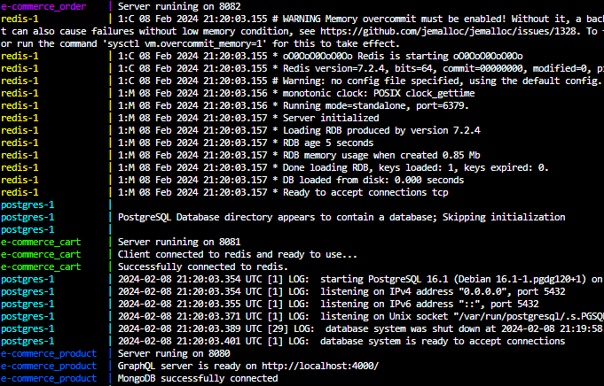

# Basic Microservice Application: E-Commerce

This project is a small e-commerce application developed to understand microservice architecture and Docker usage. There are three different services in the project, including basic features such as product management, cart operations and order management. An API gateway using NGINX is utilized to streamline incoming requests and direct them to the appropriate microservices.

An NGINX server has been configured as an API gateway to manage incoming requests and route them to the respective microservices. This setup enhances scalability, simplifies request management, and facilitates future updates to the microservices architecture. The NGINX configuration ensures seamless communication between clients and the microservices.

 
The project includes these; Nodejs, MongoDB, Redis, PostgreSQL, Graphql

The application consists of the following services:

### 1. Product Service  
- Holds products and users.
- Built with MongoDB, Node.js and Express.
- Features:
  - Add, update and delete products
  - User registration and login
- APIs:
  - `/api/product/` - (GET) Returns all products.
  - `/api/product/` - (POST) Adds a new product.
  - `/api/products/:id` - (GET) Returns the product with the id.
  - `/api/category/` - (GET) Returns all categories.
  - `/api/category/` - (POST) Adds a new categories.
  - `/api/category/:id` - (GET) Returns the categories with the id.
  - `/auth/login` - (POST) Provides user login.
  - `/api/category/:id` - (GET) Allows user to register.

### 2. Cart Service:
- Keeps the carts of the users.
- Developed with Redis and Node.js.
- Features:
  - Adding and removing products from the cart
  - View cart contents
- APIs:
  - `/cart/:id` - (GET) Retrieves the user's cart.
  - `/cart/` - (POST)   adds a specific product to the user's cart.
  - `/cart/` - (Delete) Removes a specific product from the user's cart.
 
### 2. Order Service::
- Holds orders.
- Developed with PostgreSQL and Node.js.
- Features:
  - Ordering.
  - View order history
  - Order tracking
- APIs:
  - `/api/orders` - (GET) Get all orders.
  - `/api/orders/:id` - (GET) Get an order.
  - `/api/orders` - (POST) Adds a new order.
  - `/api/orders/:id` - (Delete) Removes an order.
 

### Additional Features:  
- **GraphQL APIs**: GraphQL APIs are available for the product service.
  - `/graphql` - Access point to GraphQL APIs.
 

### Setup
1. Clone the project from GitHub:  
   `git clone https://github.com/Yesarib/Basic-Microservice-E-Commerce.git`
2. Go to project directory:  
   `cd E-commerce`
3. Create a .env file for all services and enter the necessary database information.
4. Run on Docker:  
   `docker-compose up`

**Ports where services run:**  
- Product Service: localhost:8080
- Cart Service: localhost:8081
- Order Service: localhost:8082

 
 
 

